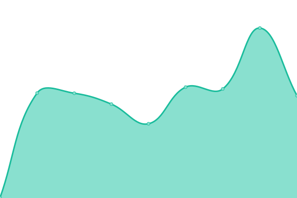

# [📈 Live Status](https://gbifatlas.github.io/status): <!--live status--> **🟩 All systems operational**

This repository contains the open-source uptime monitor and status page for [gbifatlas](https://gbifatlas.github.io/status), powered by [Upptime](https://github.com/upptime/upptime).

With [Upptime](https://upptime.js.org), you can get your own unlimited and free uptime monitor and status page, powered entirely by a GitHub repository. We use [Issues](https://github.com/gbifatlas/status/issues) as incident reports, [Actions](https://github.com/gbifatlas/status/actions) as uptime monitors, and [Pages](https://gbifatlas.github.io/status) for the status page.

<!--start: status pages-->
<!-- This summary is generated by Upptime (https://github.com/upptime/upptime) -->
<!-- Do not edit this manually, your changes will be overwritten -->
<!-- prettier-ignore -->
| URL | Status | History | Response Time | Uptime |
| --- | ------ | ------- | ------------- | ------ |
|  [GBIF Portugal](https://www.gbif.pt/) | 🟩 Up | [gbif-portugal.yml](https://github.com/gbifatlas/status/commits/HEAD/history/gbif-portugal.yml) | 

 2373ms
     
 | 

<a href="https://gbifatlas.github.io/status/history/gbif-portugal">99.84%</a>
    

|  [Data - GBIF Portugal](https://dados.gbif.pt/) | 🟩 Up | [data-gbif-portugal.yml](https://github.com/gbifatlas/status/commits/HEAD/history/data-gbif-portugal.yml) | 

 751ms
     
 | 

<a href="https://gbifatlas.github.io/status/history/data-gbif-portugal">100.00%</a>
    

|  [Regions - GBIF Portugal](https://regioes.gbif.pt/) | 🟩 Up | [regions-gbif-portugal.yml](https://github.com/gbifatlas/status/commits/HEAD/history/regions-gbif-portugal.yml) | 

 730ms
     
 | 

<a href="https://gbifatlas.github.io/status/history/regions-gbif-portugal">100.00%</a>
    

|  [Metadata - GBIF Portugal](https://metadados.gbif.pt/) | 🟩 Up | [metadata-gbif-portugal.yml](https://github.com/gbifatlas/status/commits/HEAD/history/metadata-gbif-portugal.yml) | 

 957ms
     
 | 

<a href="https://gbifatlas.github.io/status/history/metadata-gbif-portugal">100.00%</a>
    

|  [Images - GBIF Portugal](https://imagens.gbif.pt/) | 🟩 Up | [images-gbif-portugal.yml](https://github.com/gbifatlas/status/commits/HEAD/history/images-gbif-portugal.yml) | 

 911ms
     
 | 

<a href="https://gbifatlas.github.io/status/history/images-gbif-portugal">100.00%</a>
    

|  [GBIF Spain](https://www.gbif.es/) | 🟩 Up | [gbif-spain.yml](https://github.com/gbifatlas/status/commits/HEAD/history/gbif-spain.yml) | 

 690ms
     
 | 

<a href="https://gbifatlas.github.io/status/history/gbif-spain">100.00%</a>
    

|  [Data - GBIF Spain](https://datos.gbif.es/) | 🟩 Up | [data-gbif-spain.yml](https://github.com/gbifatlas/status/commits/HEAD/history/data-gbif-spain.yml) | 

 572ms
     
 | 

<a href="https://gbifatlas.github.io/status/history/data-gbif-spain">100.00%</a>
    

|  [IPT - GBIF Spain](https://ipt.gbif.es/) | 🟩 Up | [ipt-gbif-spain.yml](https://github.com/gbifatlas/status/commits/HEAD/history/ipt-gbif-spain.yml) | 

 610ms
     
 | 

<a href="https://gbifatlas.github.io/status/history/ipt-gbif-spain">100.00%</a>
    

|  [eLearning - GBIF Spain](https://elearning.gbif.es/) | 🟩 Up | [e-learning-gbif-spain.yml](https://github.com/gbifatlas/status/commits/HEAD/history/e-learning-gbif-spain.yml) | 

 727ms
     
 | 

<a href="https://gbifatlas.github.io/status/history/e-learning-gbif-spain">100.00%</a>
    

|  [Records - GBIF Spain](https://registros.gbif.es/) | 🟩 Up | [records-gbif-spain.yml](https://github.com/gbifatlas/status/commits/HEAD/history/records-gbif-spain.yml) | 

 1324ms
     
 | 

<a href="https://gbifatlas.github.io/status/history/records-gbif-spain">100.00%</a>
    

<!--end: status pages-->

[**Visit our status website →**](https://gbifatlas.github.io/status)

## 📄 License

- Powered by: [Upptime](https://github.com/upptime/upptime)
- Code: [MIT](./LICENSE) © [gbifatlas](https://gbifatlas.github.io/status)
- Data in the `./history` directory: [Open Database License](https://opendatacommons.org/licenses/odbl/1-0/)
